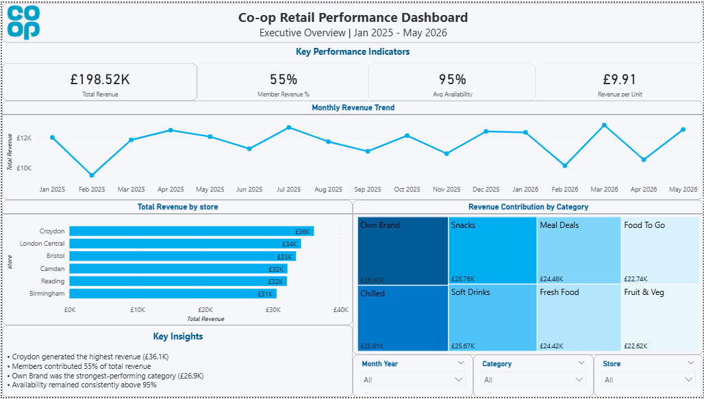
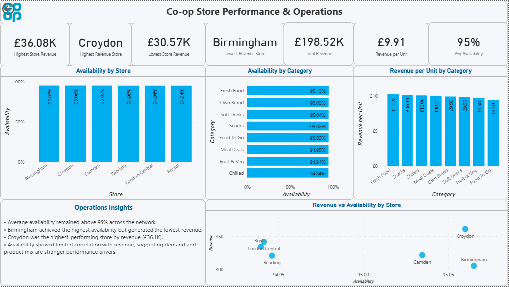
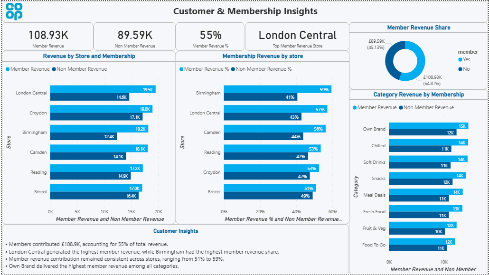

# Coop Retail Analysis Dashboard 2025-26

## Business Objective
The primary objective of this project is to develop a comprehensive retail analytics dashboard for the Co-operative retail organization. This dashboard aims to provide actionable insights into sales performance, customer behavior, and operational metrics across multiple store locations. The analysis will help stakeholders make data-driven decisions to optimize inventory management, enhance customer satisfaction, and improve overall profitability.

## Dataset Overview
The dataset comprises retail transaction data collected from multiple Co-operative store locations. It includes:
- **Transaction Details**: Sales records with timestamps, product information, and monetary values
- **Store Information**: Location-based data and store performance metrics
- **Customer Data**: Membership details and purchasing patterns
- **Product Categories**: Classification of items sold across different categories
- **Time-based Metrics**: Daily, monthly, and seasonal sales trends

The data spans a significant period, capturing diverse retail operations and customer interactions across various store formats.

## Data Cleaning and Preparation
Data preparation involved several key steps:
- **Missing Value Handling**: Identified and addressed null values across critical columns
- **Data Type Conversion**: Standardized data types for consistency and analysis
- **Duplicate Removal**: Eliminated redundant records to ensure data integrity
- **Outlier Detection**: Identified and handled anomalous values in sales and quantity fields
- **Date Standardization**: Converted date formats for temporal analysis
- **Category Mapping**: Consolidated product categories for meaningful segmentation
- **Data Validation**: Cross-checked key metrics for accuracy and consistency

The cleaned dataset is now ready for analysis and visualization.

## Dashboard Pages
The interactive dashboard includes the following pages:

### 1. Executive Overview
High-level KPI dashboard displaying:
- Total sales revenue and transaction volume
- Year-over-year growth metrics
- Top-performing stores and categories
- Monthly revenue trends

### 2. Store Performance & Operations
Store-level analytics including:
- Sales performance by store location
- Operational efficiency metrics
- Store-wise category performance
- Regional comparisons and benchmarking

### 3. Customer & Membership Insights
Customer analysis section featuring:
- Member vs. non-member sales breakdown
- Customer segmentation and purchasing patterns
- Member retention and growth metrics
- Average transaction value by customer type

## Key Insights
- Primary revenue drivers and high-performing product categories
- Customer purchasing behavior and seasonal trends
- Store performance variations and opportunities for improvement
- Member engagement and loyalty program effectiveness
- Regional and temporal patterns in sales data

## Tools Used
- **Microsoft Power BI**: Interactive dashboard creation and visualization
- **Python**: Data cleaning, exploration, and preparation (scripts included)
- **Excel/CSV**: Data storage and intermediate processing
- **DAX**: Advanced measures and calculated fields in Power BI

## Dashboard Preview
The dashboard provides interactive visualizations with:
- Dynamic filtering capabilities for date ranges, stores, and categories
- Drill-down functionality for detailed analysis
- Real-time KPI cards for quick performance assessment
- Trend analysis and comparative charts

For detailed specifications and technical documentation, refer to the scripts and analysis files in the repository.
